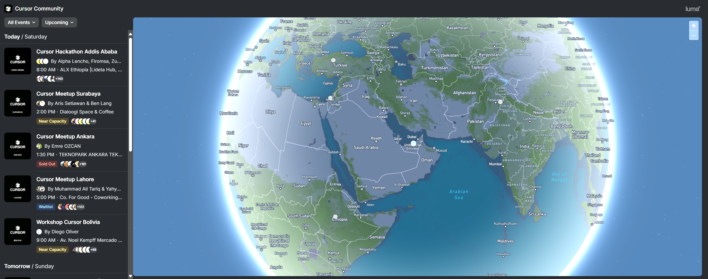
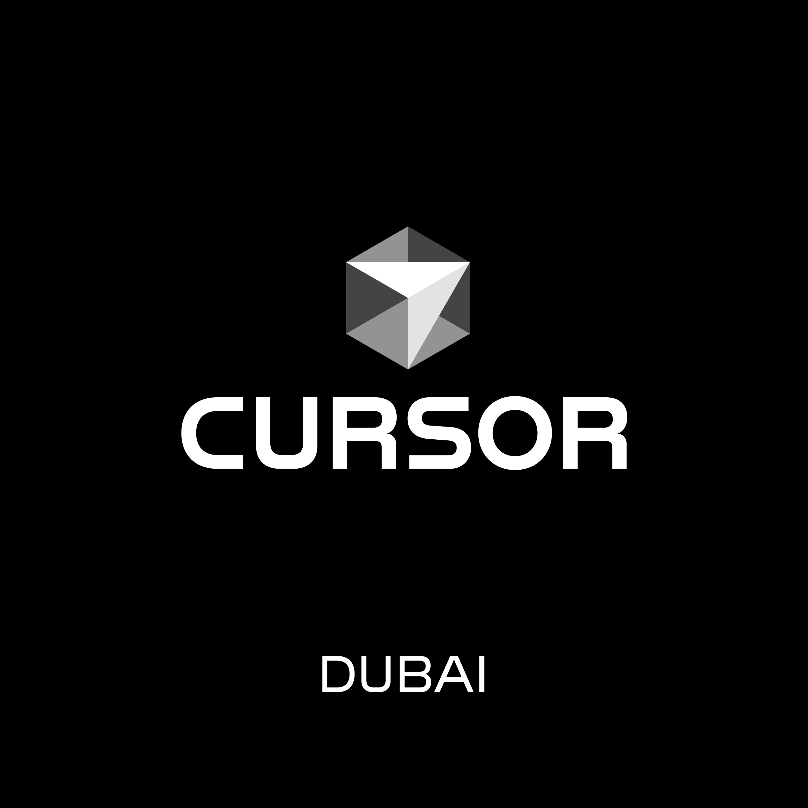

  

    <h2 class="text-3xl font-bold mb-6">Access the Slides</h2>
    
    

      <a href="https://cursor-dubai.github.io/slides/" class="text-sm text-white opacity-80 hover:opacity-100 transition-opacity">cursor-dubai.github.io/slides</a>
    

  

---

<GlowBackground>
  <h1 class="text-6xl md:text-8xl font-bold tracking-tight text-white">Cursor Dubai</h1>
</GlowBackground>

---

# Community Map

  

    
    
Click to explore the global Cursor community

  

---

# Welcome

  

    

      JdO
    

    

      <h3 class="font-semibold text-lg">Juanjo do Olmo</h3>
      
Cursor Ambassador UAE

      
Medical AI Specialist @ Department of Health Abu Dhabi

    

  

  

    

      DP
    

    

      <h3 class="font-semibold text-lg">Dan Perks</h3>
      
Cursor Team

      
Joining us virtually at 6:00 PM

    

  

---

# About Your Host

  <h3 class="text-xl font-semibold mb-4">Professional</h3>
  

    

      🏥
      Building Medical AI team @ <b>Department of Health Abu Dhabi</b>
    

    

      🎓
      Pharmacy → AI/Research Masters → Healthcare AI and GenAI
    

    

      🚀
      Co-founder of <b>AI, Drugs & Robots</b> (170k+ community)
    

    

      💻
      Teaching Cursor across Spanish-speaking AI programs
    

  

  <h3 class="text-xl font-semibold mb-4">Personal</h3>
  

    

      🥋
      BJJ practitioner 🟣
    

    

      🥽
      VR enthusiast
    

    

      🧠
      Next obsession: Neuroscience & Neurotech
    

  

---

# Agenda

  
4:30-5:00

  

    <h3 class="font-semibold">Welcome & Ice Breakers</h3>
  

  
5:00-5:30

  

    <h3 class="font-semibold">Juanjo: Cursor Is All You Need</h3>
  

  
5:30-6:00

  

    <h3 class="font-semibold">Q&A Session</h3>
  

  
6:00-6:30

  

    <h3 class="font-semibold">Dan Perks (Cursor Team) - Virtual Session</h3>
  

  
6:30-7:15

  

    <h3 class="font-semibold">Juanjo: Some Demos</h3>
  

  
7:15-8:30

  

    <h3 class="font-semibold">Networking, F&B & Open Discussions</h3>
  

  
8:30+

  

    <h3 class="font-semibold">(Optional) Afterparty 🎉</h3>
  

---
layout: intro
---

# Cursor Is All You Need

**The AI-First Programming Environment**

---

# What is Cursor?

## **An AI-First Code Editor**
Cursor is a programming environment powered by large language models (LLMs) designed to support developers across the spectrum of AI-assisted programming.

## **Key Concepts**
- **LLMs**: Predict the next token using context (conversation + files + prompts)
- **Context**: The data the model sees when generating responses
- **Tokens**: Units of text that determine size and cost
- **Model Selection**: Choose LLMs based on reasoning, speed, or cost

--- 

## Core Features

## **🎯 Tab (Autocomplete)**
- In-house model trained on code
- Multi-line and block suggestions
- Cross-file navigation
- Natural coding workflow

## **✏️ Inline Edit**
- Highlight code + Cmd+K
- Perfect for refactoring
- Add documentation
- Rewrite functions

## **🤖 Agent**
- Read/write codebase access
- Ask mode: Query responses
- Agent mode: Takes action
- Multi-step reasoning
- Background execution

---

# AI Foundations

## **Understanding Context Management**

### **Context Window**
- System prompts
- File attachments
- User input
- Conversation history

### **Smart Features**
- Context visualization
- Auto-summarization
- Intelligent caching
- Tool calling

---

# AI-Assisted Development

## **Use Cases & Best Practices**

### **Generation**
- Code creation
- Test writing
- Documentation
- Planning

### **Analysis**
- Code search
- Debugging
- Refactoring
- Optimization

### **Best Practices**
- Small commits
- Strong tests
- Clear prompts
- Version control

---

# Workflow Progression

## **From Beginner to Power User**

  
1

  
<strong>Tab Autocomplete:</strong> Begin typing and accept suggestions with Tab

  
2

  
<strong>Inline Edit:</strong> Select code, press Cmd+K, ask for changes

  
3

  
<strong>Agent Chat:</strong> "Add tests" or "Refactor this class" (Cmd+I)

  
4

  
<strong>Background Agent:</strong> Run broader tasks like "Find and fix bugs"

---

# Why Cursor Is All You Need

## **Beyond Just Coding**
- 🧠 **Second Brain** for Knowledge Management
- 💻 **All-in-One** Development Environment  
- 🚀 **AI-Powered** Productivity Multiplier

## **Model Agnostic**
- Choose the best LLM for each task
- Frontier models, multimodal, local models, etc.
- Cost vs. performance optimization
- Future-proof architecture

---

## Special Guest from Cursor!

DP

<h2 class="text-3xl font-bold mb-2">Dan Perks</h2>

Cursor Team

6:00 PM - Virtual Session

Personal Introduction

Live Q&A

---

demos

---

# Call for Speakers

## **Future Cursor Events - Dubai & Abu Dhabi**

  <h3 class="text-xl font-semibold mb-4 text-center">We're Looking For</h3>
  

    

      🎯
      

        
Cool Demos

        
Show what you've built with Cursor

      

    

    

      🤝
      

        
Partners & Sponsors

        
Support our growing community

      

    

    

      👨‍🏫
      

        
Teachers & Educators

        
Share your expertise

      

    

    

      🚀
      

        
Success Stories

        
Inspire others with your journey

      

    

  

  

    <h3 class="text-xl font-semibold mb-4">Get In Touch</h3>
    

      
juanjodoolmo@gmail.com

    

    
Ready to share your Cursor story?

  

---

## Join Cursor UAE Community

  

    
    

      

        
Weekly Tips

      

      

        
Event Updates

      

    

  

---

# Scan to Join

  

      
  

---

# Upcoming Events

  

    

      AD
    

    

      <h3 class="text-xl font-semibold">Cursor Abu Dhabi</h3>
      
Saturday, August 2nd

    

  

  

    

      
      Similar intro format
    

    

      
      New demos & speakers
    

    

      
      Growing the capital's tech community
    

  

  

    

      Q4
    

    

      <h3 class="text-xl font-semibold">After Summer</h3>
      
September 2025

    

  

  

    

      
      Large-scale events in both cities
    

    

      
      International speakers
    

    

      
      Hands-on workshops
    

    

      
      Partner showcases
    

  

---

# Cursor UAE Vision

## **Building the Future Together**

  

    🌍
    <h3 class="text-lg font-semibold">Connect</h3>
  

  
Build bridges between developers across the Emirates, fostering collaboration and knowledge sharing

  

    📚
    <h3 class="text-lg font-semibold">Educate</h3>
  

  
Spread knowledge about AI-powered development and best practices for using Cursor effectively

  

    🚀
    <h3 class="text-lg font-semibold">Accelerate</h3>
  

  
Drive innovation in the region by empowering developers with cutting-edge AI tools and workflows

  

    🤝
    <h3 class="text-lg font-semibold">Collaborate</h3>
  

  
Strengthen ties with the global Cursor community while building our local ecosystem

---

# Let's Build Together

## **Today is Just the Beginning**

  <h3 class="text-xl font-semibold mb-4 text-center">During the Event</h3>
  

    

      1
      Share your projects powered by Cursor
    

    

      2
      Ask questions and learn from peers
    

  

  <h3 class="text-xl font-semibold mb-4 text-center">After Tonight</h3>
  

    

      3
      Connect with the community
    

    

      4
      Shape the future of development in UAE
    

  

---

## Thank You    
© Cursor Community

  

    <h2 class="text-3xl font-bold mb-6">Let's Connect!</h2>    
    

      

        🐦
        

          
Twitter/X

          
@claxterix

        

      
      
      

        💼
        

          
LinkedIn

          
Juanjo do Olmo

        

      
      
      

        🤖
        

          
AI, Drugs & Robots

          
170k+ followers community

        

      

    
    
    

      
See you next week in Abu Dhabi!

    
    
  

 